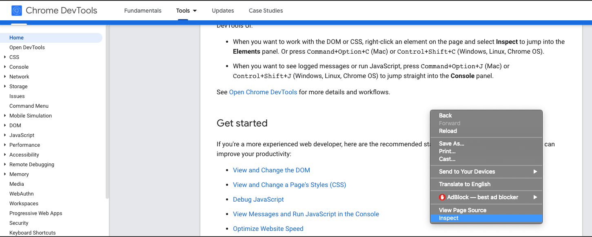
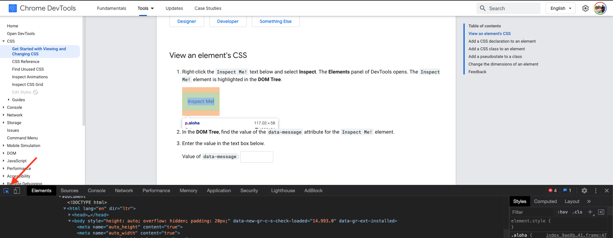

# Chrome Dev Tools

Chrome Dev Tools คือ คือเครื่องมือสำหรับ Web Developer ที่อยู่บน Google Chrome Browser

Chrome Dev Tools ช่วยในการแก้ไข Web Pages และตรวจสอบปัญหาการทำงานเกี่ยวกับ Web

**Features**

- [View and Change the DOM](https://developers.google.com/web/tools/chrome-devtools/dom)
- View and Change a Page's Styles (CSS)
- Debug JavaScript
- View Messages and Run JavaScript in the Console
- Optimize Website Speed
- Inspect Network Activity

Reference: [Developers Google](https://developers.google.com/web/tools/chrome-devtools#:~:text=Chrome%20DevTools%20is%20a%20set,you%20build%20better%20websites%2C%20faster.)

ใน Session นี้เราจะมาดูกันแค่ในเรื่องของการดู Elements และการเปลี่ยนแปลง Elements บนหน้าเว็บกันอย่างเดียวนะ

## View and Change the DOM

ให้เราลองเข้าเว็บที่เราชอบสัก 1 เว็บ จากนั้นให้เราคลิกขวาที่หน้าเว็บ แล้วเลือก Inspect

จากนั้นเราจะเห็น Window ขึ้นมา ให้เราเลือกไปที่ Tab Elements

จากนั้นกด Icon ลูกศรซ้ายสุดตามลูกศรสีส้ม แล้วเลื่อนเมาส์ไปที่ Elements บนหน้าเว็บ

## In Class Exercises 🏅

ให้เปิด Web Shopee แล้วลองใช้ Chrome Dev Tools ในการดูรายละเอียด Elements นั้น ๆ และลองแก้ไขเบื้องต้น

## Take Home Exercises 🏅

ให้เปิด Web Twitter แล้วลองใช้ Chrome Dev Tools ในการดูรายละเอียด Elements นั้น ๆ และลองแก้ไขเบื้องต้น
