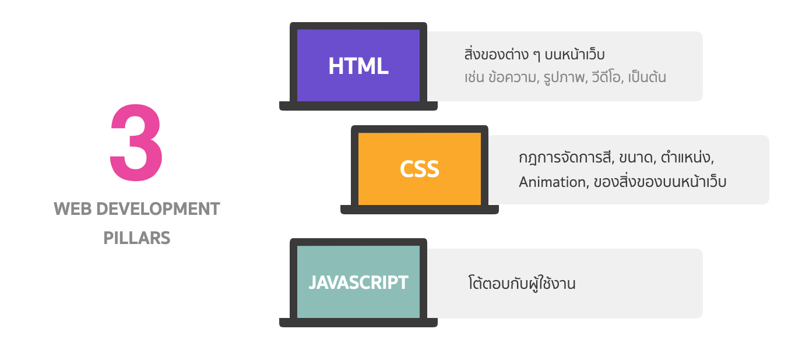

# Web Development Pillars

การพัฒนา Software ที่เป็น Web Application นั้นประกอบไปด้วย 3 เสาหลักใหญ่ ๆ คือ HTML, CSS, และ JavaScript (JS)

- **HTML** เป็นตัวที่สร้างสิ่งของต่าง ๆ บนหน้าเว็บ
- **CSS** เป็นกฏการจัดการสี ขนาด ตำแหน่ง ของสิ่งของบนหน้าเว็บ
- **JavaScript (JS)** เป็นภาษาโปรแกรมที่ทำให้หน้าเว็บสามารถโต้ตอบกับผู้ใช้งานได้ เช่น การพิมพ์กรอกข้อมูล, การ click เพื่อจ่ายเงินสินค้า, Etc.

 
 

  <a href="https://github.com/napatwongchr/intro-to-html/blob/main/lessons/0-introduction.md"><< ไปก่อนหน้า</a>
  <a href="https://github.com/napatwongchr/intro-to-html/blob/main/lessons/2-simple-web-architecture.md">หน้าต่อไป >></a>

